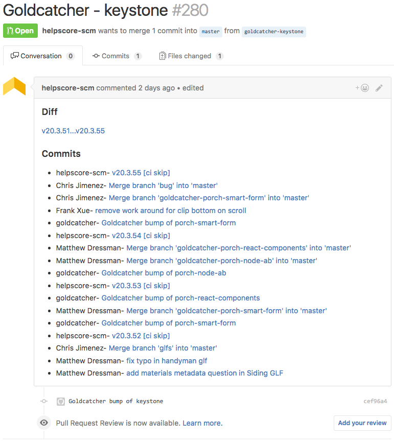

Up to Code
===========

Up-to-code keeps your node apps up to date.  Every time you publish a new
library, Up-to-code will create a beautiful pull request for every node app in
your organization that needs a version bump.

# About

Let's say you work at a company that has lots of node apps and lots of
javascript libraries.  When you make a change to one of those libraries, you
would like your node apps to update to the latest version.  Up-to-code
automates this process by creating a pull request to update the version in
package.json.  The Up-to-code pull request will include links to easily see a
diff of the updates, new version, and link to other similar pull requests.
This gives the app owner a chance to review the updates and keep their project
up to code.

## Example
A Up-to-code pull request contains lots of useful info:

# Usage

## Running with docker

The easiest way to use Up-to-code is docker.  After publishing a new version
of awesome-js-library, you can make sure all apps are up to date by running a
docker command like this:

    docker run \
        -e npm_config_registry=http://npm.example.com/nexus/content/groups/npmall/ \
        -e npm_config_email=npm@example.com \
        -e npm_config_always_auth=true \
        -e npm_config__auth=npmpassword \
        -e DEBUG="porch:uptocode*" \
        porchdotcom/up-to-code:latest \
        --package-name=awesome-js-library \
        --github-org=myorg \
        --github-token=abcdef12abcdef12abcdef12abcdef12abcdef12 \
        --gitlab-user=uptocodeacct \
        --gitlab-org=myorg \
        --gitlab-token=abcd123 \
        --gitlab-host=gitlab.example.com

### Docker hub

The docker build [up-to-code can be found on dockerhub](https://hub.docker.com/r/porchdotcom/up-to-code/)

## Options

### --package-name

The recently published library that your projects depend on.

### --github-org

The name of the github organization containing your projects.

### --github-token

Github token with permissions to read repos and create pull requests.

### --gitlab-user

Gitlab user name that will read repos and create pull requests.

### --gitlab-token

Gitlab token granting permissions to read repos and create merge requests.

### --gitlab-org

The name of the gitlab organization containing your projects.

### --gitlab-host

Domain name of self hosted gitlab instance.  For example `gitlab.porch.com`

## Environment Variables

[NPM configuration](https://docs.npmjs.com/misc/config) is passed to Up-to-code through environment variables. For
example, if you have a private npm registry, you should configure it using `npm_config_registry=http://mynpm.example.com`.
Anything required to access your npm host in your .npmrc file should be passed to Up-to-code through and environment variable.

### Commonly used npm config

At a minimum, you likely need to define the following environment variables for
a private npm registry:

    npm_config_registry
    npm_config__auth

### DEBUG="porch:uptocode*"

Enable verbose logging for Up-to-code

# Supported platforms

Up-to-code can create pull requests on github and gitlab.  It has been tested
with sinopia and nexus npm registries.

